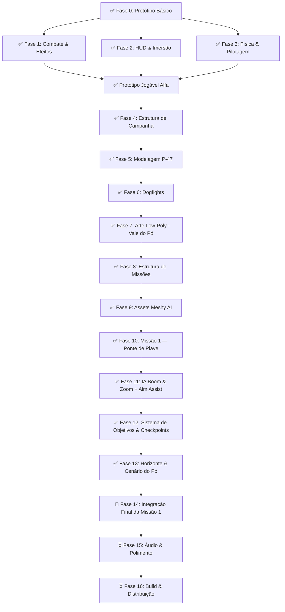

# 🚀 Plano de Desenvolvimento - Senta a Pua!

Este documento estabelece as fases de desenvolvimento para evoluir o protótipo básico da Godot Engine em um game loop completo e imersivo, alinhado com a direção de arte low-poly de alto contraste e a campanha histórica do 1º GAvCa na Itália (1944-1945).

---

## ✅ Fase 0: Protótipo Básico (Concluída)
*Criar o esqueleto jogável do projeto na Godot 4.*

- [x] Projeto Godot 4 configurado (Forward+ renderer)
- [x] Cena principal com chão, iluminação direcional e céu procedural (pôr do sol)
- [x] Voo arcade básico: pitch (cima/baixo), roll (esquerda/direita), velocidade constante
- [x] Controles de aviação: pitch invertido (puxar = sobe), roll direto (esquerda = inclina esquerda)
- [x] Sistema de tiro: 8 metralhadoras calibre .50 com convergência a 150m
- [x] Disparo contínuo ao segurar barra de espaço
- [x] Projéteis com colisão e auto-destruição após 3s

**Commit:** `e0c1dcc`

---

## ✅ Fase 1: Combate & Efeitos Visuais (Concluída)
*Tornar o mundo hostil e dar feedback visual para a destruição.*

- [x] **Torres Flak ativas:** disparam projéteis vermelhos contra o jogador dentro de 180m de alcance
- [x] **Explosões low-poly:** CPUParticles3D com cubos laranja/amarelo emissivos que se dispersam e caem com gravidade
- [x] **Sistema de vida:** P-47 com 100 HP, perde 20 por tiro inimigo
- [x] **Colisão com torres:** bater de raspão ou direto explode tanto a torre quanto o avião
- [x] **Reinício automático:** 1.5s de delay após explosão antes de recarregar a cena

**Commit:** `754630b`

---

## ✅ Fase 2: HUD & Interface (Concluída)
*Dar ao jogador informações de combate direto na tela.*

- [x] **Mira reticular (crosshair):** cruz verde neon desenhada via `_draw()` com ponto central
- [x] **Painel de status (HUD 2D):**
  - Integridade do P-47 (%)
  - Velocidade em MPH (escala ×7.5, ~150-480 MPH)
  - Altitude em pés (FT)
  - Nome do piloto ativo + contador de alvos destruídos
- [x] **Camera shake:** tremor leve ao atirar (recoil das .50), tremor forte ao levar dano

**Commit:** `15d0e08`

---

## ✅ Fase 3: Física & Pilotagem (Concluída)
*O P-47 Thunderbolt era um "tanque voador" de 7 toneladas. A pilotagem precisa transmitir esse peso.*

- [x] **Controle de aceleração (Throttle):** teclas W (acelerar) e S (desacelerar)
- [x] **Velocidade variável:** range de 20 a 65 m/s, afetando sustentação e agilidade
- [x] **Gravidade + Sustentação (Lift):** física simplificada — lift no eixo Y local, proporcional à velocidade
- [x] **Stall implícito:** desacelerar demais ou voar invertido → perda de altitude
- [x] **Rastros de vapor nas asas:** partículas brancas ativadas em curvas fechadas (roll/pitch > 70%)
- [x] **Hélice animada:** velocidade de rotação proporcional ao throttle

**Commit:** `d155908` (junto com Fases 4 e 5)

---

## ✅ Fase 4: Estrutura de Campanha (Concluída)
*Criar o fluxo completo do jogo com começo, meio e fim.*

- [x] **GameManager (AutoLoad):** singleton global gerenciando pilotos, pontuação e estado
- [x] **Permadeath de pilotos:** 6 pilotos históricos reais do 1º GAvCa:
  - Ten. Rui Moreira Lima
  - Cap. Joel Miranda
  - Ten. Alberto Torres
  - Ten. Danilo Moura
  - Cap. Newton Lagares
  - Ten. Josino Maia
- [x] **Progressão de pilotos:** cada crash → próximo piloto assume. Todos mortos → Game Over
- [x] **Menu principal:** tela com título, subtítulo histórico, botões "Decolar" e "Sair"
- [x] **Tela de Vitória:** Missão Cumprida com texto histórico sobre a campanha no Vale do Pó
- [x] **Tela de Game Over:** Fim da Campanha com opção de reorganizar esquadrão
- [x] **Condição de vitória:** todos os inimigos (torres + caças) destruídos

**Commit:** `d155908`

---

## ✅ Fase 5: Modelagem do P-47 Thunderbolt (Concluída)
*Substituir os blocos genéricos por um modelo low-poly detalhado do caça.*

- [x] **Fuselagem:** corpo principal verde-oliva (cor histórica da FAB)
- [x] **Cowl do motor:** amarelo vibrante (marca registrada das cores da FAB na Itália)
- [x] **Canopy:** vidro azul translúcido com transparência
- [x] **8 metralhadoras calibre .50:** montadas fisicamente na borda de ataque das asas
- [x] **Hélice:** mesh metálica que gira em tempo real proporcional ao throttle
- [x] **Empenagem:** leme vertical e profundor horizontal na cauda
- [x] **Câmera em terceira pessoa:** posicionada atrás e acima do avião

**Commit:** `d155908` (junto com Fases 3 e 4)

---

## ✅ Fase 6: Dogfights - Caças Inimigos (Concluída)
*Adicionar combate aéreo contra aeronaves inimigas com IA de perseguição.*

- [x] **Modelo de caça inimigo:** low-poly vermelho escuro com canopy avermelhado e hélice funcional
- [x] **IA de perseguição:** slerp-based smooth tracking, voa em direção ao jogador
- [x] **Lógica de disparo:** atira rajadas vermelhas quando alinhado (< 15°) e dentro de 140m
- [x] **Balanceamento:** turn_speed 1.4 vs 2.5 do jogador — possível despistar com manobras
- [x] **Dois caças inimigos** posicionados no ar em main.tscn
- [x] **Integração com GameManager:** contam como alvos para condição de vitória

**Commit:** `97a6b77`

---

## ✅ Fase 7: Arte Low-Poly - Vale do Pó (Concluída)
*Substituir os blocos genéricos do cenário por assets low-poly estilizados com iluminação adequada.*

- [x] **Scene Builder:** gerador procedural de geometria low-poly (`scene_builder.gd`)
- [x] **Terreno:** grid de placas facetadas simulando colinas do Vale do Pó
- [x] **Montanhas:** Alpes italianos em camadas geométricas com topo nevado
- [x] **Ciprestes:** árvores cônicas italianas (tronco + folhagem em camadas)
- [x] **Vilarejo italiano:** prédios com telhados terracota, igreja com torre sineira e cruz
- [x] **Ponte ferroviária + trem:** locomotiva a vapor alemã com 3 vagões de suprimentos
- [x] **Depósito de munição:** caixas empilhadas
- [x] **Torre Flak refinada:** base de concreto, cano angulado, escudo blindado
- [x] **Materiais corrigidos:** `SHADING_MODE_PER_PIXEL` substituiu `UNSHADED` (fim do visual Minecraft)
- [x] **Paleta de cores:** verde-oliva, terracota, concreto, tons de montanha com neve
- [x] **Explosões melhoradas:** sistema dual fogo + fumaça escura
- [x] **Fumaça persistente:** coluna de fumaça que permanece após destruição (`smoke_pillar.tscn`)
- [x] **Iluminação:** fog atmosférico, névoa aérea, sol alaranjado de pôr do sol

**Commit:** `ba1f215`, `af34b33`

---

## ✅ Fase 8: Estrutura de Missões (Concluída)
*Transformar o mapa único em uma campanha com missões baseadas em eventos históricos reais.*

- [x] **Sistema de fases/missões:** 5 cenas independentes com progressão sequencial
- [x] **Missão 1 - Patrulha:** voar sobre o Vale do Pó, eliminar 2 caças + 2 torres Flak
- [x] **Missão 2 - Interdição:** destruir ponte ferroviária + trem de suprimentos + 3 torres + 2 caças
- [x] **Missão 3 - Caça-bombardeio:** atacar depósito de munição + ninho de artilharia + 4 torres + 3 caças
- [x] **Missão 4 - Escolta:** proteger 3 bombardeiros B-25 de 4 caças inimigos
- [x] **Missão 5 - 22 de Abril de 1945:** ofensiva final — 5 torres + 4 caças + ponte + depósito
- [x] **Briefing pré-missão:** tela com título, subtítulo histórico, briefing narrativo e lista de objetivos
- [x] **Debriefing pós-missão:** tela de missão cumprida com pilotos perdidos e próximo destino
- [x] **Sistema de progressão:** Menu → Briefing → Missão → Missão Cumprida → Briefing (próx.) → ... → Vitória Final
- [x] **Assets específicos:** ninho de artilharia com sandbags, bombardeiro B-25 low-poly
- [x] **HUD expandido:** mostra nome da missão atual

**Commit:** `537db1a`

---

## ✅ Fase 9: Assets Meshy AI (Concluída)
*Substituir toda a geometria procedural por modelos 3D gerados por IA (Meshy), com texturas reais e silhuetas detalhadas.*

- [x] **P-47 Thunderbolt:** modelo GLB detalhado com texturas (`p47.glb`, `p47_player.tscn`)
- [x] **Bf 109 inimigo:** caça alemão com canopy e texturas (`bf109.glb`, `bf109_enemy.tscn`)
- [x] **Flak 88:** canhão antiaéreo alemão detalhado (`flak88.glb`, `flak88_enemy.tscn`)
- [x] **B-25 Mitchell:** bombardeiro aliado para missões de escolta (`b25.glb`)
- [x] **Cipreste italiano:** árvore cônica com folhagem texturizada (`cypress.glb`)
- [x] **Igreja italiana:** torre sineira com cruz e telhado terracota (`church.glb`)
- [x] **Prédio de vilarejo:** arquitetura rural italiana (`village_building.glb`)
- [x] **Casa de fazenda:** farmhouse rústica (`farmhouse.glb`, `farmhouse_scene.tscn`)
- [x] **Ponte ferroviária:** estrutura metálica detalhada (`railway_bridge.glb`, `bridge_segment.tscn`)
- [x] **Locomotiva a vapor:** trem alemão com texturas (`steam_train.glb`)
- [x] **Vagão de carga:** boxcar WWII (`boxcar.glb`)
- [x] **Trilhos ferroviários:** straight + curved track tiles (`rail_straight.glb`, `rail_curve.glb`)
- [x] **Depósito de munição:** ammo depot (`ammo_depot.glb`)
- [x] **Bunker:** fortificação defensiva (`bunker.glb`)
- [x] **Scripts adaptados:** `player_meshy.gd` e `enemy_meshy.gd` para usar modelos GLB

**Commit:** `b5c2733` (Piave terrain), assets em `assets/meshy/`

---

## ✅ Fase 10: Missão 1 — Batismo de Fogo: Ponte de Piave (Concluída)
*Primeira missão histórica real: destruir ponte ferroviária sobre o Rio Piave, cortando suprimentos alemães à Linha Gótica (Novembro de 1944).*

- [x] **Discovery document:** pesquisa histórica e direção visual (`docs/DISCOVERY_MISSAO1.md`)
- [x] **Paleta outonal:** céu azul pálido, campos dourados, neblina matinal, montanhas Dolomitas
- [x] **Rio Piave:** rio largo verde-acizentado com segmentos curvos
- [x] **Ponte ferroviária no centro:** alvo principal da missão com segmentos destruíveis
- [x] **Iterações de design:** 5 versões da cena (`mission_piave.tscn` a `mission_piave_v4.tscn` + `final`)
- [x] **Ambiente procedural por missão:** cada cena de missão gera seu próprio WorldEnvironment + terreno
- [x] **Shader customizado:** `mission_piave_final.gdshader` para efeitos visuais específicos
- [x] **Montanhas no chão:** correção de floating mountains (agora Y=0)

**Commits:** `c65aeaf`, `a85c923`, docs em `docs/DISCOVERY_MISSAO1.md`

---

## ✅ Fase 11: IA Boom & Zoom + Aim Assist (Concluída)
*IA de caças inimigos com táticas realistas de combate aéreo e assistência de mira para o jogador.*

- [x] **Boom & Zoom state machine:** CHASE → EXTEND → RETURN (`enemy_fighter.gd`)
  - CHASE: persegue e atira quando alinhado (< 15°)
  - EXTEND: ao chegar muito perto, foge em linha reta em alta velocidade (55 m/s) por 3.2s
  - RETURN: volta com curva ampla cinematográfica (turn_speed × 0.55) até re-adquirir o alvo
- [x] **Parâmetros exportados:** close_range, extend_duration, extend_speed, return_turn_factor, reacquire_dot
- [x] **Soft-lock aim assist:** cone de 14° / 220m que ajusta convergência dos projéteis para o alvo travado
- [x] **Bullet convergence dinâmica:** projéteis convergem no locked_target quando ativo, senão no ponto fixo a 150m
- [x] **Merge protection:** só ativa EXTEND após > 1.5s de CHASE (evita fugir prematuramente)

**Commits:** `ee3aa10`

---

## ✅ Fase 12: Sistema de Objetivos & Checkpoints (Concluída)
*GameManager refatorado com tracking granular de objetivos por missão e checkpoint system.*

- [x] **Objetivos por missão:** cada missão define `objectives[]` com id, label, type, target
- [x] **Tipos de objetivo:** `bridge_pillar`, `flak_tower`, `fighter`
- [x] **Progress tracking:** `objective_progress` (contagem atual) e `objectives_completed` (concluídos)
- [x] **Vitória condicional:** missão completa só quando TODOS os objetivos atingem seus targets
- [x] **bridge_segment.gd:** segmentos de ponte com HP, explosão, fumaça e report ao GameManager
- [x] **Checkpoint system:** 3 mortes permitidas por checkpoint antes de perder o piloto
- [x] `checkpoint_death()` / `reset_checkpoint_deaths()` / `save_checkpoint()`
- [x] **HUD de objetivos:** `objective_hud.gd` com progresso visual
- [x] **Mission 1 config:** 2 bridge pillars + 3 flak towers + 2 fighters, checkpoint_deaths=3

**Commit:** `ee3aa10` (junto com Fase 11)

---

## ✅ Fase 13: Horizonte & Cenário do Vale do Pó (Concluída)
*Sistema de horizonte em camadas, Terrain3D, natureza procedural e limite de missão.*

- [x] **Sistema de céu em camadas:** experimentos com panorama sphere, cylinder, flat plane — assentou em céu procedural + strips de horizonte
- [x] **Parallax layered horizon:** sistema de background com parallax (`hills.gd`, `skybox_cylinder.gd`)
- [x] **Terrain3D integration:** plugin habilitado, heightmap-based terrain (`piave-terrain.tscn`)
- [x] **Ground texture procedural:** `ground_texture.gd` gera textura tática do terreno
- [x] **Po Valley builder:** `po_valley_builder.gd` para construção procedural do cenário
- [x] **Alps background:** `alps.gd` para cadeia de montanhas ao fundo
- [x] **Scene builder assets:** `scene_builder_assets.gd` — factory de florestas, rochas, etc.
- [x] **Ultimate Nature Pack:** assets Quaternius completos importados (árvores, arbustos, rochas, grama — normal, autumn, dead, snow)
- [x] **Boundary guard:** `boundary_guard.gd` — mantém jogador dentro da área de missão (warning + crash após 5s)
- [x] **Ambiente refatorado:** `main_environment.gd` com fog, luz, sky procedural
- [x] **Componentes de ambiente:** `ground.tscn`, `mountain.tscn`, `river_segment.tscn`, `skysphere.tscn`
- [x] **Iluminação outonal quente:** warmer Po Valley lighting (`e50f087`)

**Commits:** `714b1fa` até `53215dc` (sky saga), `9f90a18`, `b5c2733`, `e50f087`, `553d945`

---

---

## 🔄 Fase 14: Integração Final da Missão 1 (Em Andamento)
*Unificar todos os sistemas na Missão 1 funcional e jogável do início ao fim.*

- [x] GameManager com suporte a objetivos e checkpoints
- [x] Cenário do Piave com ponte, rio, montanhas e vegetação
- [x] Modelos Meshy para P-47, Bf 109, Flak 88, ponte
- [x] IA boom & zoom + aim assist
- [x] Boundary guard
- [ ] **🐛 Unificar cena da missão:** escolher a melhor versão (v2/v3/v4/final) e consolidar
- [ ] **Spawn de inimigos:** integrar spawn de Flak towers + Bf 109 fighters na cena da missão
- [ ] **HUD funcional:** crosshair, objective HUD, status do piloto integrados na missão
- [ ] **Briefing → Missão → Debriefing:** fluxo completo da Missão 1 com telas de transição
- [ ] **Vitória condicional:** testar fluxo de destruir todos os objetivos → tela de missão cumprida
- [ ] **Game Over:** testar morte de piloto → próximo piloto → Game Over após 6 pilotos
- [ ] **Balanceamento:** ajustar HP da ponte, quantidade de inimigos, dificuldade
- [ ] **Teste de gameplay completo:** jogar a missão do início ao fim

---

## ⏳ Fase 15: Áudio & Polimento (Futura)
*Adicionar camada sonora e refinar a experiência.*

- [ ] **Motor do P-47:** som radial do Pratt & Whitney R-2800 Double Wasp
- [ ] **Metralhadoras calibre .50:** som de disparo com cadência realista
- [ ] **Explosões e impactos:** sons de detonação e fragmentação
- [ ] **Artilharia antiaérea (Flak):** estouros no ar e zumbido de estilhaços
- [ ] **Música:** trilha sonora orquestral com tema brasileiro da época
- [ ] **Vozes dos pilotos:** chatter de rádio em português durante o combate
- [ ] **Menu com áudio:** som ambiente na tela de menu e transições
- [ ] **Opções de áudio:** controle de volume (master, SFX, música, vozes)

---

## ⏳ Fase 16: Build & Distribuição (Futura)
*Preparar o jogo para ser jogado por outras pessoas.*

- [ ] **Exportar para desktop:** Windows, macOS, Linux via Godot export templates
- [ ] **Ícone e splash screen:** branding do jogo com o avestruz "Senta a Pua!"
- [ ] **Configurações:** resolução, fullscreen, qualidade gráfica
- [ ] **Controles configuráveis:** teclado e suporte a gamepad/joystick
- [ ] **Página no itch.io:** distribuição gratuita para a comunidade
- [ ] **README do projeto:** instruções de build, créditos, referências históricas
- [ ] **Testes de performance:** framerate estável em hardware modesto

---

## 📋 Backlog de Bugs Conhecidos

| # | Descrição | Prioridade |
|---|---|---|
| 1 | `enemy.gd` faz `look_at` + `rotate_y(PI)` — pode causar orientação errada da torre | Média |
| 2 | `enemy_bullet.gd` verifica `body.name.begins_with("Enemy")` — inconsistente com nomes como "EnemyFighter" | Média |
| 3 | `GameManager.enemy_destroyed()` usa `await` — frágil se chamado durante `queue_free()` | Alta |
| 4 | Torretas não têm limite de rotação vertical — podem atirar para qualquer ângulo | Baixa |
| 5 | Sem feedback visual de dano no P-47 (fumaça, faíscas) antes da explosão final | Média |
| 6 | Caças inimigos atravessam o chão e montanhas (sem detecção de terreno) | Alta |

---

## 🎨 Referências Visuais

A direção de arte do projeto segue o estilo **low-poly de alto contraste**:

- **Low-poly:** modelagem geométrica facetada, cores sólidas, sem texturas realistas
- **Alto contraste:** iluminação dramática (pôr do sol alaranjado/roxo), sombras duras, glow em elementos emissivos
- **Paleta de cores:** verde-oliva (P-47), amarelo (cowl do motor), laranja/amarelo (explosões e traçantes aliados), vermelho (inimigos e Flak)
- **Referências visuais:** ver artes conceituais geradas — "Retorno ao Pôr do Sol", "Fogo no Vale do Pó", "Cockpit e Tensão"

---

> [!NOTE]
> **Progresso atual:** 13 de 16 fases concluídas. Jogo possui: combate aéreo completo, HUD, física de voo, campanha com permadeath (6 pilotos históricos) + checkpoints, dogfights com IA boom & zoom realista, aim assist soft-lock, 16 modelos Meshy AI (P-47, Bf 109, Flak 88, B-25, ponte, trem, vilarejo, etc.), sistema de objetivos por missão, boundary guard, Terrain3D + Ultimate Nature Pack, cenário do Vale do Pó com Rio Piave procedural, e 5 missões históricas com briefing e progressão.
>
> **Próximo passo recomendado:** Fase 14 — Integração Final da Missão 1 (consolidar cena da ponte de Piave com todos os sistemas funcionando juntos).
>
> **Commits mais recentes:** `553d945` (editor plugins), `b5c2733` (Terrain3D), `ee3aa10` (boom & zoom + aim assist), `9f90a18` (terrain fields).
