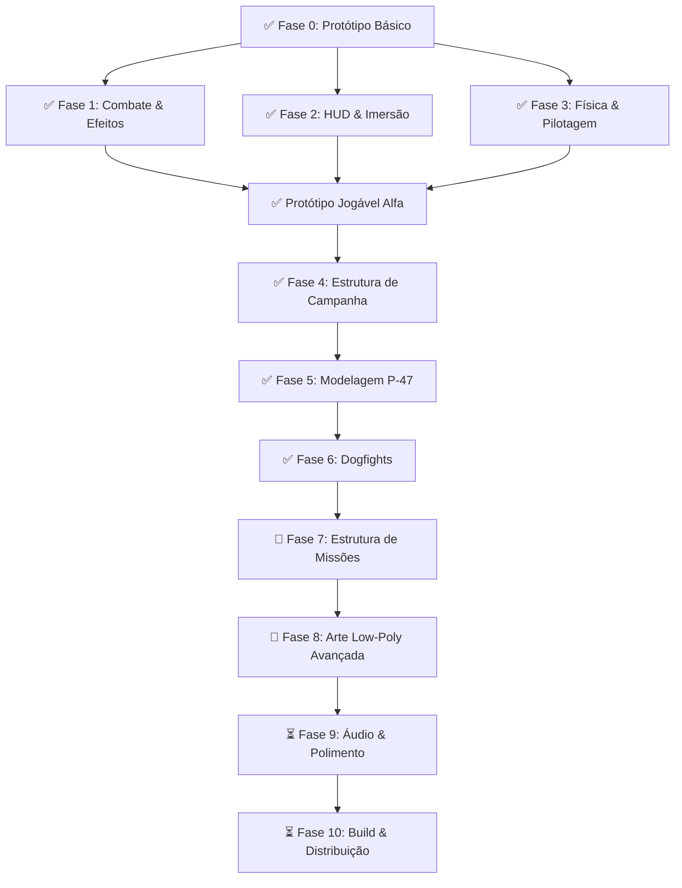

# 🚀 Plano de Desenvolvimento - Senta a Pua!

Este documento estabelece as fases de desenvolvimento para evoluir o protótipo básico da Godot Engine em um game loop completo e imersivo, alinhado com a direção de arte low-poly de alto contraste e a campanha histórica do 1º GAvCa na Itália (1944-1945).

---

## ✅ Fase 0: Protótipo Básico (Concluída)
*Criar o esqueleto jogável do projeto na Godot 4.*

- [x] Projeto Godot 4 configurado (Forward+ renderer)
- [x] Cena principal com chão, iluminação direcional e céu procedural (pôr do sol)
- [x] Voo arcade básico: pitch (cima/baixo), roll (esquerda/direita), velocidade constante
- [x] Controles de aviação: pitch invertido (puxar = sobe), roll direto (esquerda = inclina esquerda)
- [x] Sistema de tiro: 8 metralhadoras calibre .50 com convergência a 150m
- [x] Disparo contínuo ao segurar barra de espaço
- [x] Projéteis com colisão e auto-destruição após 3s

**Commit:** `e0c1dcc`

---

## ✅ Fase 1: Combate & Efeitos Visuais (Concluída)
*Tornar o mundo hostil e dar feedback visual para a destruição.*

- [x] **Torres Flak ativas:** disparam projéteis vermelhos contra o jogador dentro de 180m de alcance
- [x] **Explosões low-poly:** CPUParticles3D com cubos laranja/amarelo emissivos que se dispersam e caem com gravidade
- [x] **Sistema de vida:** P-47 com 100 HP, perde 20 por tiro inimigo
- [x] **Colisão com torres:** bater de raspão ou direto explode tanto a torre quanto o avião
- [x] **Reinício automático:** 1.5s de delay após explosão antes de recarregar a cena

**Commit:** `754630b`

---

## ✅ Fase 2: HUD & Interface (Concluída)
*Dar ao jogador informações de combate direto na tela.*

- [x] **Mira reticular (crosshair):** cruz verde neon desenhada via `_draw()` com ponto central
- [x] **Painel de status (HUD 2D):**
  - Integridade do P-47 (%)
  - Velocidade em MPH (escala ×7.5, ~150-480 MPH)
  - Altitude em pés (FT)
  - Nome do piloto ativo + contador de alvos destruídos
- [x] **Camera shake:** tremor leve ao atirar (recoil das .50), tremor forte ao levar dano

**Commit:** `15d0e08`

---

## ✅ Fase 3: Física & Pilotagem (Concluída)
*O P-47 Thunderbolt era um "tanque voador" de 7 toneladas. A pilotagem precisa transmitir esse peso.*

- [x] **Controle de aceleração (Throttle):** teclas W (acelerar) e S (desacelerar)
- [x] **Velocidade variável:** range de 20 a 65 m/s, afetando sustentação e agilidade
- [x] **Gravidade + Sustentação (Lift):** física simplificada — lift no eixo Y local, proporcional à velocidade
- [x] **Stall implícito:** desacelerar demais ou voar invertido → perda de altitude
- [x] **Rastros de vapor nas asas:** partículas brancas ativadas em curvas fechadas (roll/pitch > 70%)
- [x] **Hélice animada:** velocidade de rotação proporcional ao throttle

**Commit:** `d155908` (junto com Fases 4 e 5)

---

## ✅ Fase 4: Estrutura de Campanha (Concluída)
*Criar o fluxo completo do jogo com começo, meio e fim.*

- [x] **GameManager (AutoLoad):** singleton global gerenciando pilotos, pontuação e estado
- [x] **Permadeath de pilotos:** 6 pilotos históricos reais do 1º GAvCa:
  - Ten. Rui Moreira Lima
  - Cap. Joel Miranda
  - Ten. Alberto Torres
  - Ten. Danilo Moura
  - Cap. Newton Lagares
  - Ten. Josino Maia
- [x] **Progressão de pilotos:** cada crash → próximo piloto assume. Todos mortos → Game Over
- [x] **Menu principal:** tela com título, subtítulo histórico, botões "Decolar" e "Sair"
- [x] **Tela de Vitória:** Missão Cumprida com texto histórico sobre a campanha no Vale do Pó
- [x] **Tela de Game Over:** Fim da Campanha com opção de reorganizar esquadrão
- [x] **Condição de vitória:** todos os inimigos (torres + caças) destruídos

**Commit:** `d155908`

---

## ✅ Fase 5: Modelagem do P-47 Thunderbolt (Concluída)
*Substituir os blocos genéricos por um modelo low-poly detalhado do caça.*

- [x] **Fuselagem:** corpo principal verde-oliva (cor histórica da FAB)
- [x] **Cowl do motor:** amarelo vibrante (marca registrada das cores da FAB na Itália)
- [x] **Canopy:** vidro azul translúcido com transparência
- [x] **8 metralhadoras calibre .50:** montadas fisicamente na borda de ataque das asas
- [x] **Hélice:** mesh metálica que gira em tempo real proporcional ao throttle
- [x] **Empenagem:** leme vertical e profundor horizontal na cauda
- [x] **Câmera em terceira pessoa:** posicionada atrás e acima do avião

**Commit:** `d155908` (junto com Fases 3 e 4)

---

## ✅ Fase 6: Dogfights - Caças Inimigos (Concluída)
*Adicionar combate aéreo contra aeronaves inimigas com IA de perseguição.*

- [x] **Modelo de caça inimigo:** low-poly vermelho escuro com canopy avermelhado e hélice funcional
- [x] **IA de perseguição:** slerp-based smooth tracking, voa em direção ao jogador
- [x] **Lógica de disparo:** atira rajadas vermelhas quando alinhado (< 15°) e dentro de 140m
- [x] **Balanceamento:** turn_speed 1.4 vs 2.5 do jogador — possível despistar com manobras
- [x] **Dois caças inimigos** posicionados no ar em main.tscn
- [x] **Integração com GameManager:** contam como alvos para condição de vitória

**Commit:** `97a6b77`

---

## 🔄 Fase 7: Estrutura de Missões (Próxima)
*Transformar o mapa único em uma campanha com missões baseadas em eventos históricos reais.*

- [ ] **Sistema de fases/missões:** carregar mapas diferentes por missão
- [ ] **Missão 1 - Patrulha:** voar por waypoints, eliminar caças inimigos no ar
- [ ] **Missão 2 - Interdição:** destruir pontes e comboios de suprimentos no Vale do Pó
- [ ] **Missão 3 - Caça-bombardeio:** atacar ninhos de artilharia e trens blindados
- [ ] **Missão 4 - Escolta:** proteger bombardeiros aliados de caças inimigos
- [ ] **Missão 5 - 22 de Abril de 1945:** missão final épica — 44 surtidas, gerenciamento de recursos, clímax
- [ ] **Briefing pré-missão:** tela com contexto histórico e objetivos
- [ ] **Debriefing pós-missão:** estatísticas (alvos destruídos, dano sofrido, pilotos perdidos)
- [ ] **Sistema de progressão:** desbloquear missões seguintes ao completar anteriores

---

## 🔄 Fase 8: Arte Low-Poly Avançada (Futura)
*Elevar o visual para o nível das artes conceituais de referência.*

- [ ] **Modelo P-47 refinado:** geometria mais detalhada (cilindros facetados, formas de asa curvas)
- [ ] **Texturas e materiais:** paleta de cores cuidada, flat shading, sem texturas fotorealistas
- [ ] **Cenário do Vale do Pó:** montanhas geométricas, vilarejos italianos estilizados, rios
- [ ] **Iluminação dramática:** pôr do sol alaranjado/roxo, sombras duras (alto contraste)
- [ ] **Efeitos atmosféricos:** névoa, nuvens geométricas, glow em traçantes e explosões
- [ ] **Substituir blocos placeholder** por modelos low-poly temáticos
- [ ] **UI estilizada:** fontes e painéis com identidade visual da época (1940s militar)

---

## ⏳ Fase 9: Áudio & Polimento (Futura)
*Adicionar camada sonora e refinar a experiência.*

- [ ] **Motor do P-47:** som radial do Pratt & Whitney R-2800 Double Wasp
- [ ] **Metralhadoras calibre .50:** som de disparo com cadência realista
- [ ] **Explosões e impactos:** sons de detonação e fragmentação
- [ ] **Artilharia antiaérea (Flak):** estouros no ar e zumbido de estilhaços
- [ ] **Música:** trilha sonora orquestral com tema brasileiro da época
- [ ] **Vozes dos pilotos:** chatter de rádio em português durante o combate
- [ ] **Menu com áudio:** som ambiente na tela de menu e transições
- [ ] **Opções de áudio:** controle de volume (master, SFX, música, vozes)

---

## ⏳ Fase 10: Build & Distribuição (Futura)
*Preparar o jogo para ser jogado por outras pessoas.*

- [ ] **Exportar para desktop:** Windows, macOS, Linux via Godot export templates
- [ ] **Ícone e splash screen:** branding do jogo com o avestruz "Senta a Pua!"
- [ ] **Configurações:** resolução, fullscreen, qualidade gráfica
- [ ] **Controles configuráveis:** teclado e suporte a gamepad/joystick
- [ ] **Página no itch.io:** distribuição gratuita para a comunidade
- [ ] **README do projeto:** instruções de build, créditos, referências históricas
- [ ] **Testes de performance:** framerate estável em hardware modesto

---

## 📋 Backlog de Bugs Conhecidos

| # | Descrição | Prioridade |
|---|---|---|
| 1 | `enemy.gd` faz `look_at` + `rotate_y(PI)` — pode causar orientação errada da torre | Média |
| 2 | `enemy_bullet.gd` verifica `body.name.begins_with("Enemy")` — inconsistente com nomes como "EnemyFighter" | Média |
| 3 | `GameManager.enemy_destroyed()` usa `await` — frágil se chamado durante `queue_free()` | Alta |
| 4 | Torretas não têm limite de rotação vertical — podem atirar para qualquer ângulo | Baixa |
| 5 | Sem feedback visual de dano no P-47 (fumaça, faíscas) antes da explosão final | Média |
| 6 | Caças inimigos atravessam o chão e montanhas (sem detecção de terreno) | Alta |

---

## 🎨 Referências Visuais

A direção de arte do projeto segue o estilo **low-poly de alto contraste**:

- **Low-poly:** modelagem geométrica facetada, cores sólidas, sem texturas realistas
- **Alto contraste:** iluminação dramática (pôr do sol alaranjado/roxo), sombras duras, glow em elementos emissivos
- **Paleta de cores:** verde-oliva (P-47), amarelo (cowl do motor), laranja/amarelo (explosões e traçantes aliados), vermelho (inimigos e Flak)
- **Referências visuais:** ver artes conceituais geradas — "Retorno ao Pôr do Sol", "Fogo no Vale do Pó", "Cockpit e Tensão"

---

> [!NOTE]
> **Progresso atual:** 6 de 10 fases concluídas. O protótipo já possui combate aéreo completo, HUD, física de voo, campanha com permadeath, e dogfights contra IA.
>
> **Próximo passo recomendado:** Fase 7 — Estrutura de Missões históricas para transformar o sandbox em uma campanha narrativa.
